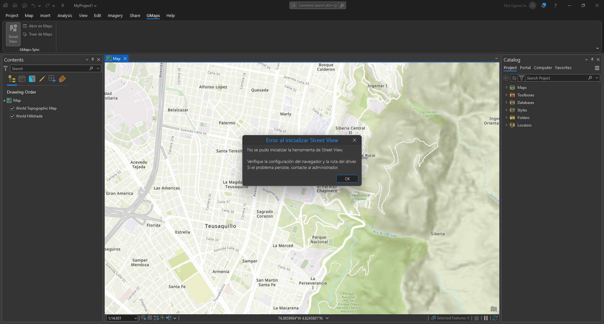

# GMaps-Sync para ArcGIS Pro

Un Add-In para ArcGIS Pro que potencia tu experiencia de mapeo integrando Google Street View y sincronizando la vista con Google Maps de forma bidireccional. Explora, navega y compara ubicaciones en tiempo real, todo desde la comodidad de tu entorno de ArcGIS Pro.

> [!note]
> Este Add-In no integra Google Maps como un navegador embebido dentro de ArcGIS Pro. Al abrir Street View o sincronizar la vista, se abrirá una ventana de navegador aparte.

## Características principales

### 1. Street View

| Modo Claro                                                                  | Modo Oscuro                                                                     |
| --------------------------------------------------------------------------- | ------------------------------------------------------------------------------- |
|  |  |

Esta herramienta permite seleccionar un punto en el mapa y la dirección de visualización. Al confirmar, Google Street View se abre en una ventana aparte, mostrando la ubicación y orientación seleccionadas.

#### ¿Como usar esta herramienta?


1. Selecciona la herramienta "Street View" de la pestaña GMaps.
2. Haz clic en el mapa donde quieras iniciar la vista.
3. Sin soltar el botón del ratón, arrastra para definir la dirección de visualización.
4. Al soltar, se abrirá Google Street View en tu navegador web predeterminado.

### 2. ArcGIS - Google Maps sync

| Modo Claro                                                       | Modo Oscuro                                                          |
| ---------------------------------------------------------------- | -------------------------------------------------------------------- |
|  |  |

Con esta herramienta, el usuario puede sincronizar la vista actual de ArcGIS Pro con Google Maps. Al activarla, se abre una ventana de navegador mostrando la misma ubicación y nivel de zoom que tiene el mapa en ArcGIS Pro.

#### ¿Como usar esta herramienta?


1. Haz clic en el botón "Abrir en Maps".
2. Se abrirá Google Maps en tu navegador con la misma ubicación y nivel de zoom.

### 3. Google Maps - ArcGIS sync

| Modo Claro                                                        | Modo Oscuro                                                           |
| ----------------------------------------------------------------- | --------------------------------------------------------------------- |
|  |  |

Esta función permite importar la vista actual de Google Maps a ArcGIS Pro. Al activarla, el mapa de ArcGIS se centra y ajusta automáticamente según la ubicación y el nivel de zoom que tenga Google Maps.

#### ¿Como usar esta herramienta?


1. Asegúrate de tener Google Maps abierto en tu navegador.
2. Navega a la ubicación deseada en Google Maps.
3. Haz clic en el botón "Traer de Maps" en ArcGIS Pro.

> [!WARNING]
> Esta función solo funciona si la ventana emergente de Google Maps, abierta por el Add-In, sigue activa y visible en tu navegador. Si la cierras o navegas a otra página, la sincronización no será posible.

## Requisitos del sistema

- ArcGIS Pro 3.4 o superior
- .NET 8 Runtime (requerido por ArcGIS Pro)
- Un navegador web compatible (Google Chrome o Mozilla Firefox)

> [!IMPORTANT]
> Consulta los requisitos oficiales de ArcGIS Pro para tu sistema operativo y hardware aquí: [ArcGIS Pro System Requirements](https://pro.arcgis.com/en/pro-app/latest/get-started/arcgis-pro-system-requirements.htm)

## Instalación

### Instalación del Add-In

1. Solicita el archivo `.esriAddinX` al responsable del proyecto o compílalo desde el código fuente.
2. Cierra ArcGIS Pro si está abierto.
3. Haz doble clic en el archivo `.esriAddinX` para registrar el Add-In en ArcGIS Pro.
4. Inicia ArcGIS Pro y verifica que la pestaña "GMaps" aparece en la Ribbon (Cinta de opciones) del entorno de trabajo.

### Configuración del WebDriver

Para que el Add-In funcione correctamente, es necesario configurar el WebDriver:

1. Descarga el WebDriver correspondiente a tu navegador:

   - [ChromeDriver](https://googlechromelabs.github.io/chrome-for-testing/) para Google Chrome
   - [GeckoDriver](https://github.com/mozilla/geckodriver/releases) para Mozilla Firefox

2. Abre ArcGIS Pro y ve a la configuración del Add-In:

   - En el menú, selecciona "Proyecto" > "Opciones" > "GMaps"
   - Selecciona el navegador que utilizarás
   - Especifica la ruta donde se encuentra el archivo del WebDriver

## Solución de problemas

### Error al abrir Street View o sincronizar mapas



- Verifica que el WebDriver esté correctamente configurado en las opciones del Add-In
- Asegúrate de que la versión del WebDriver sea compatible con la versión de tu navegador

### La sincronización no funciona correctamente


- Verifica que tienes una conexión a internet activa
- Asegúrate de que la pestaña de Google Maps esté activa y visible

## Desarrollo

Si deseas contribuir al desarrollo de este Add-In, sigue estos pasos:

### Configuración del entorno de desarrollo

1. Clona el repositorio
2. Abre la solución en Visual Studio (2022 o superior recomendado)
3. Instala las dependencias NuGet requeridas
4. Configura la ruta de salida para apuntar a la carpeta de Add-Ins de ArcGIS Pro

### Estructura del proyecto

```
SIGUE Google-Sync/
├── Application/
│   ├── Ext/              # Extensiones de utilidades
│   ├── Services/         # Servicios como WebDriverHelper
│   └── UseCases/         # Casos de uso de la aplicación
├── Core/
│   ├── Browser.cs        # Enumeraciones y tipos core
│   └── Settings.cs       # Configuración del add-in
├── Presentation/
│   ├── View/             # Vistas XAML y code-behind
│   └── ViewModel/        # ViewModels para las vistas (MVVM)
├── Images/               # Recursos gráficos para modo claro
├── DarkImages/           # Recursos gráficos para modo oscuro
├── Config.daml           # Archivo de configuración para ArcGIS Pro
└── MainModule.cs         # Punto de entrada del add-in
```

### Compilación y depuración

Para compilar y probar el Add-In:

1. Compila el proyecto en Visual Studio
2. El Add-In se instalará automáticamente en la ubicación de desarrollo de ArcGIS Pro
3. Inicia ArcGIS Pro para probar los cambios

## Licencia

Este proyecto está bajo la Licencia MIT. Consulta el archivo [LICENSE](LICENSE) para más detalles.

## Créditos y Agradecimientos

- [Selenium WebDriver](https://www.selenium.dev/documentation/en/webdriver/)
- [ArcGIS Pro SDK](https://github.com/Esri/arcgis-pro-sdk)
- [Google Maps API](https://developers.google.com/maps/documentation)
